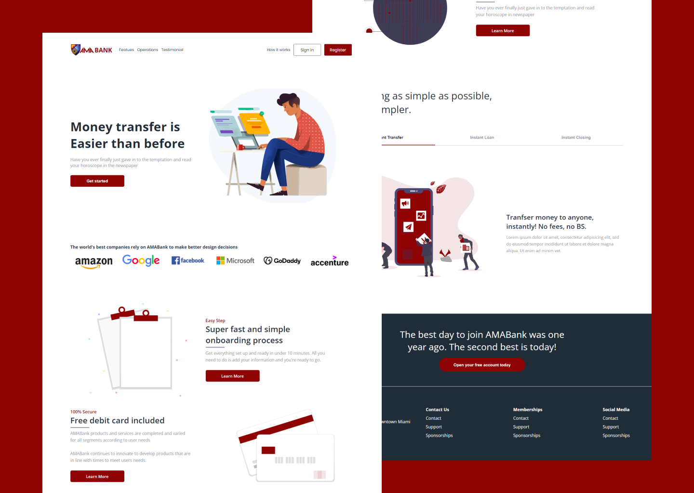

# AMA Bank - Landing page

### The Website

Users should be able to:

-  View the optimal layout for the site depending on their device's screen size
-  See hover states for all interactive elements on the page

### Screenshot

### Links

-  Solution URL: [Source Code](https://github.com/benjoquilario/AMABank-Landing-page)
-  Live Site URL: [Live Site](https://amabank-benjo.netlify.app)

## My process

### Built with

-  Semantic HTML5 markup
-  BEM methodology
-  React JS
-  JSX
-  SCSS for css preprocessor
-  CSS 3
-  Flexbox
-  CSS Grid
-  Mobile-first workflow
-  [React](https://reactjs.org/) - JS library

## Author

-  Twitter - [@iam_benjo](https://www.twitter.com/iam_benjo)
